# Peludo Heart

## CONTENTS
- [Peludo Heart](#peludo-heart)
  - [CONTENTS](#contents)
- [SUMMARY](#summary)
- [BUSINESS](#business)
  - [what is it](#what-is-it)
  - [Problem](#problem)
  - [what needs?](#what-needs)
  - [Organization chart](#organization-chart)
  - [main requirement](#main-requirement)
  - [secondary requirement](#secondary-requirement)
- [DESIGN](#design)
  - [use case diagram](#use-case-diagram)
  - [class diagram](#class-diagram)
- [API ENDPOINTS](#api-endpoints)
    - [PRODUCTS ENDPOINTS](#products-endpoints)
    - [USERS ENDPOINTS](#users-endpoints)
    - [ADOPTION ENDPOINTS](#adoption-endpoints)
    - [APPOINTMENT ENDPOINTS](#appointment-endpoints)
    - [NOTIFICATION ENDPOINTS](#notification-endpoints)
    - [CART ENDPOINTS](#cart-endpoints)
    - [ORDERS ENDPOINTS](#orders-endpoints)
- [MOBILE](#mobile)
  - [Sitemap](#sitemap)
  - [Screens](#screens)
  - [TECHNOLOGIES](#technologies)
    - [BACKEND](#backend)
    - [FRONTEND](#frontend)
    - [MOBILE](#mobile-1)
    - [DATABASE](#database)
    - [HOSTING](#hosting)
  - [DESIGN TOOL](#design-tool)
  - [METHODOLOGY](#methodology)
  - [tools](#tools)

# SUMMARY
Peludo Heart is an app to make reservations and order pet products.

|              |          |           |                 |
|--------------|----------------|--------------|----------------|
|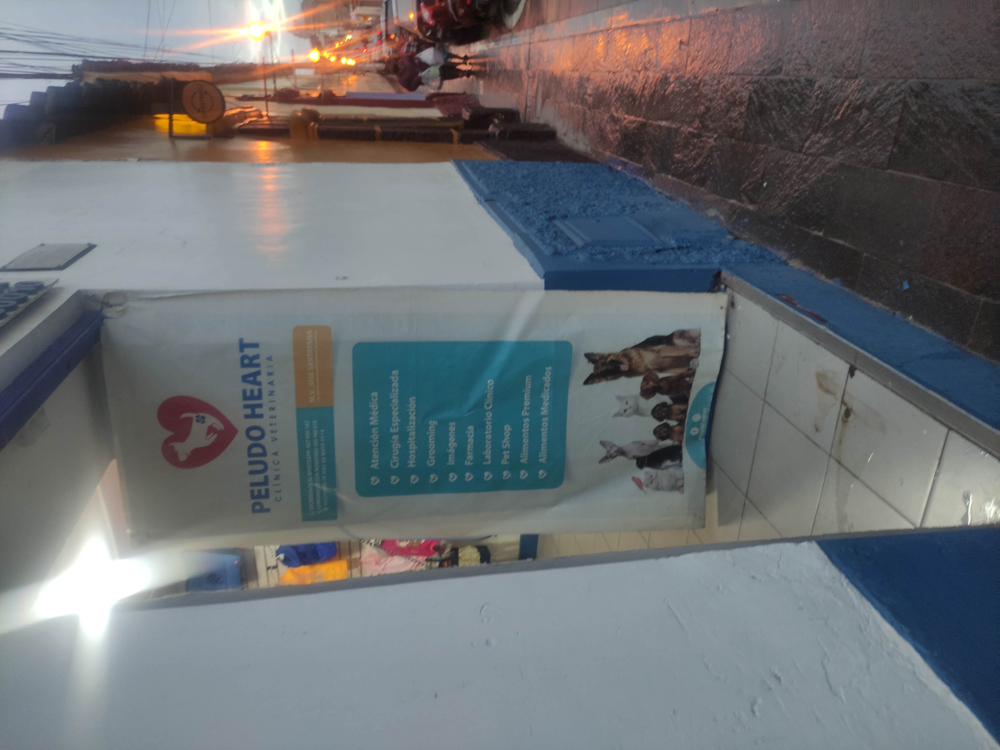 |  | |  |

# BUSINESS
## what is it
Peludo Heart is a veterinarian that offers services and products for pets.
## Problem
Peludo Heart needed to implement a way to handle orders for its products and services. currently only a notebook is used for annotating.
## what needs?
Peludo Heart needed to show his products and services to existing and new customers through an app.

## Organization chart
- Administrator | Doctor
- Doctor assistant
- Accountant (product sales manager)

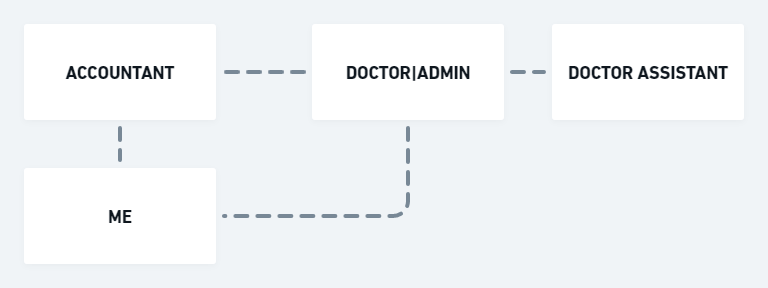

  
## main requirement
- **order products** and **offer services** 
## secondary requirement
- adoption pets

# DESIGN

## use case diagram
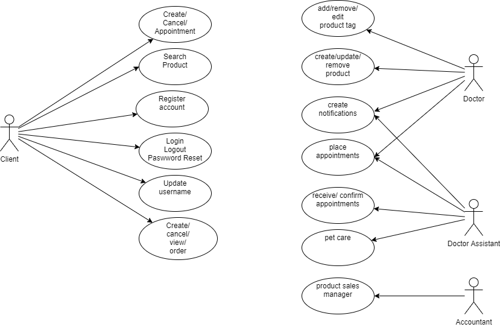

## class diagram
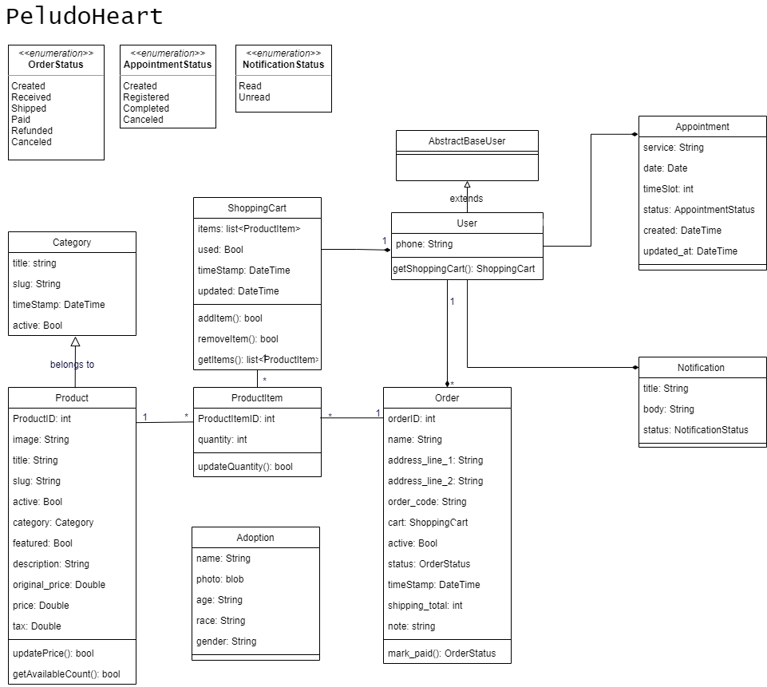

# API ENDPOINTS
### PRODUCTS ENDPOINTS
|HTTP METHOD   | API ENDPOINT   | FUNCTION   |
|--------------|----------------|------------|
|GET   | `/products/list/`            | return list of all products
|GET   | `/products/list/<slug>/`     | return detail of product by slug
|GET   | `/products/related/<id>/`    | return related products of one product by id
|GET   | `/products/category/`        | return list of products by category
|GET   | `/products/category/<id>/`   | return specific products by category by id

### USERS ENDPOINTS
|HTTP METHOD   | API ENDPOINT   | FUNCTION   |
|--------------|----------------|------------|
|POST          | `/login/`      | return token and user data
|POST          | `/users/`      | create user by phone instead of username
|PUT           | `/users/<user_id>/change_password/`      | Update password
|PUT           | `/users/<user_id>/`      | Update Phone number 

### ADOPTION ENDPOINTS
|HTTP METHOD   | API ENDPOINT   | FUNCTION   |
|--------------|----------------|------------|
|GET           | `/adoption/`     | return list of pets

### APPOINTMENT ENDPOINTS
|HTTP METHOD   | API ENDPOINT   | FUNCTION   |
|--------------|----------------|------------|
|GET           | `/appointments/list/`     | return list of appointments
|POST           | `/appointments/`     | create appointment
|UPDATE           | `/appointments/`     | update appointment
> Token is required

### NOTIFICATION ENDPOINTS
|HTTP METHOD   | API ENDPOINT   | FUNCTION   |
|--------------|----------------|------------|
|GET           | `/notifications/`     | get list of notifications
|GET           | `/notifications/<notification_id>`     | retrive notification by id
|POST           | `/notifications/mark-all-as-read/`     | mark all notifications as read
> Token is required

### CART ENDPOINTS
|HTTP METHOD   | API ENDPOINT   | FUNCTION   |
|--------------|----------------|------------|
|GET    | `/cart/`            | return current shopping cart. if the cart is used return new cart.
|POST   | `/cart/`            | add product to the cart by product_id
|PUT   | `/cart/cart-item/<int:pk>/`    | update quantity of product in the shopping cart by id of product
|DELETE   | `/cart/cart-item/<int:pk>/`        | delete product of the shopping cart by id of product in the cart
|GET   | `/cart/<product_id>/`   | verify if the product is in the shopping cart by product_id

> Token is required

### ORDERS ENDPOINTS
|HTTP METHOD   | API ENDPOINT   | FUNCTION   |
|--------------|----------------|------------|
|GET           |`/orders/`         | return list of orders of the user
|GET           |`/orders/<order_code>/` | return order detail of the user
|POST          |`/orders/checkout/`          | create order 
|PUT           |`/orders/checkout/`          | user can cancel order if the status does not change to received

> Token is required

# MOBILE
## Sitemap
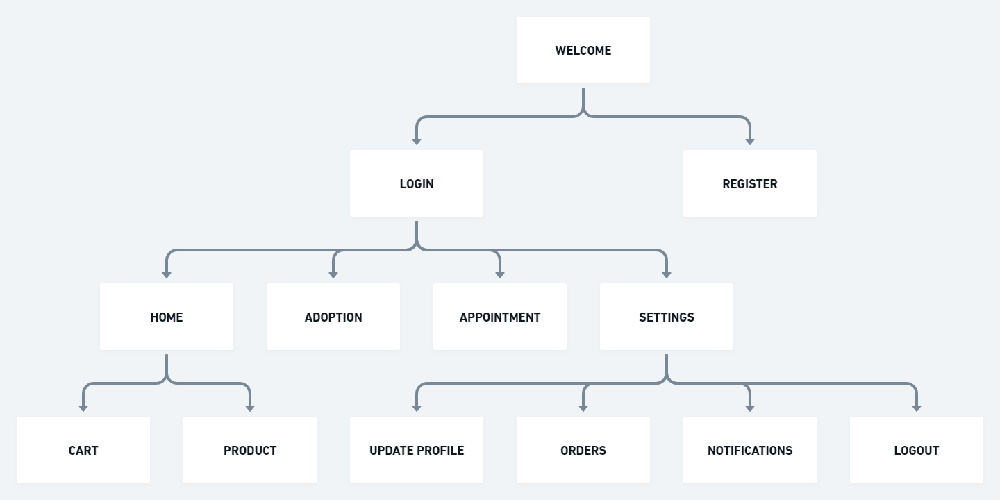

## Screens
|   |    |    | |
|--------------|----------------|------------|-----|
|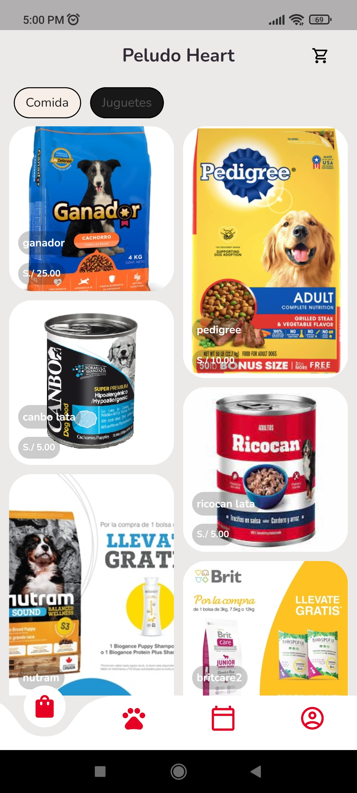 |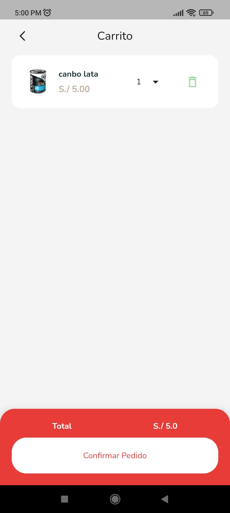 | 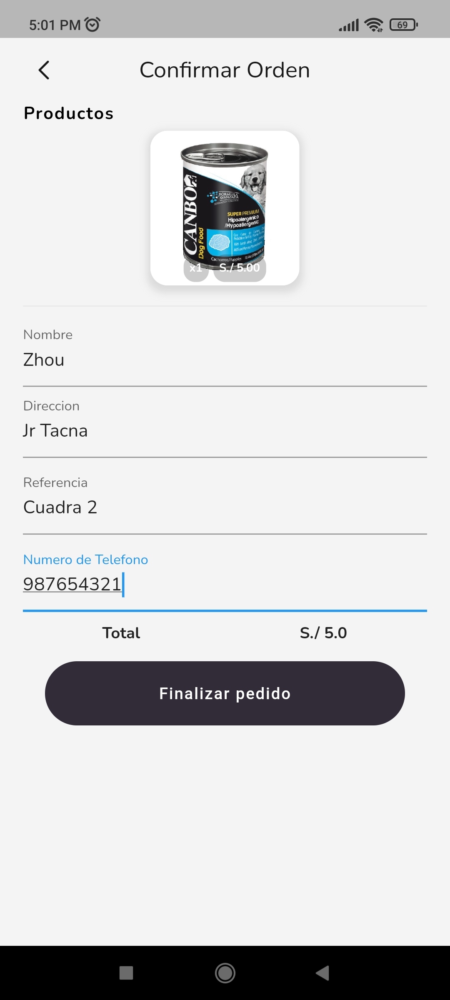 | 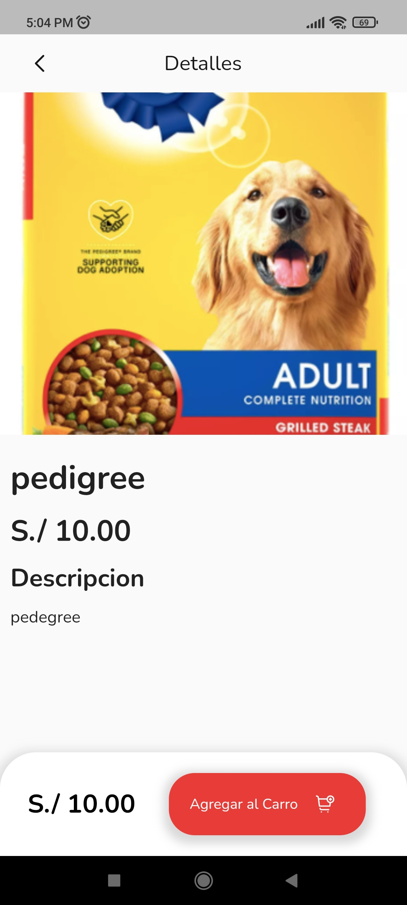 |
|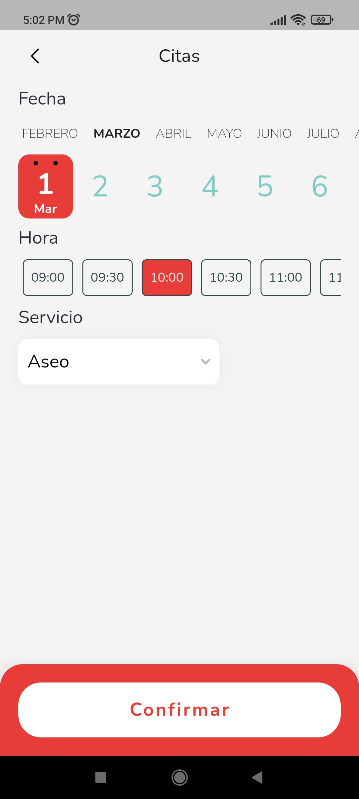 |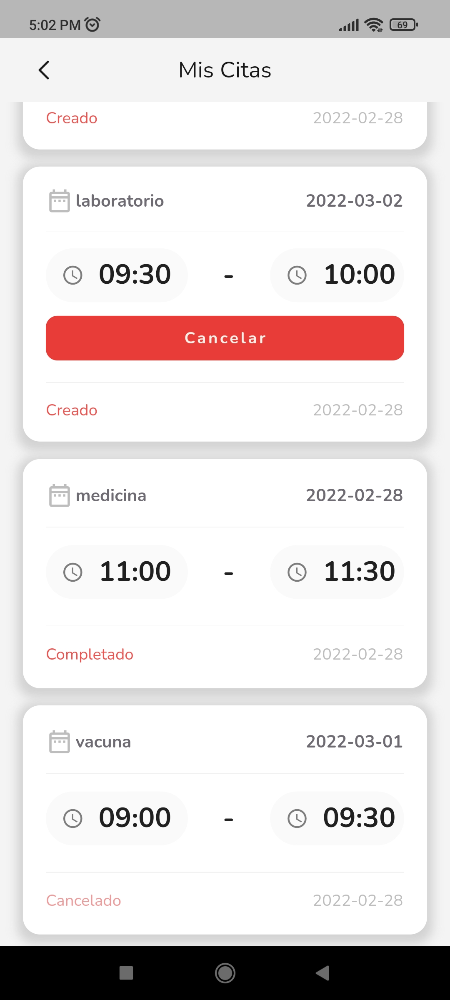 | 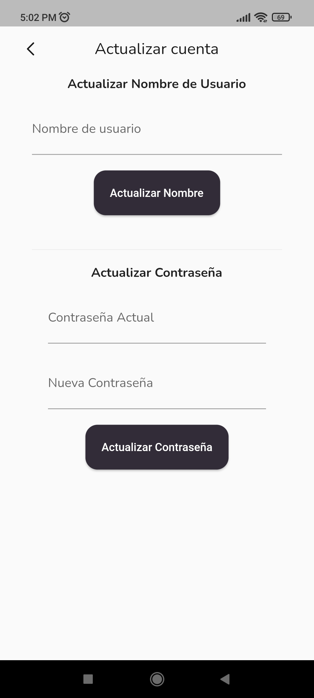 | 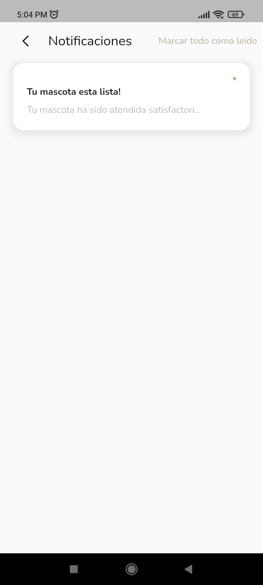 |
|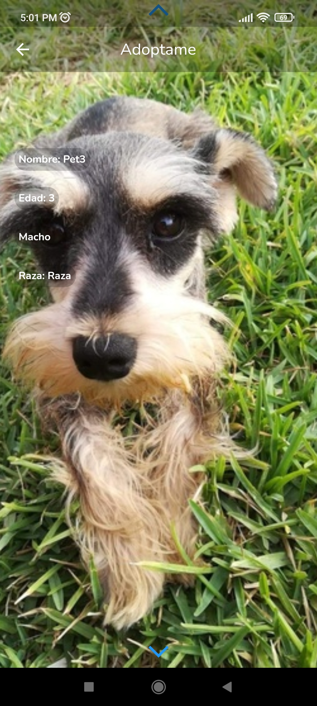 |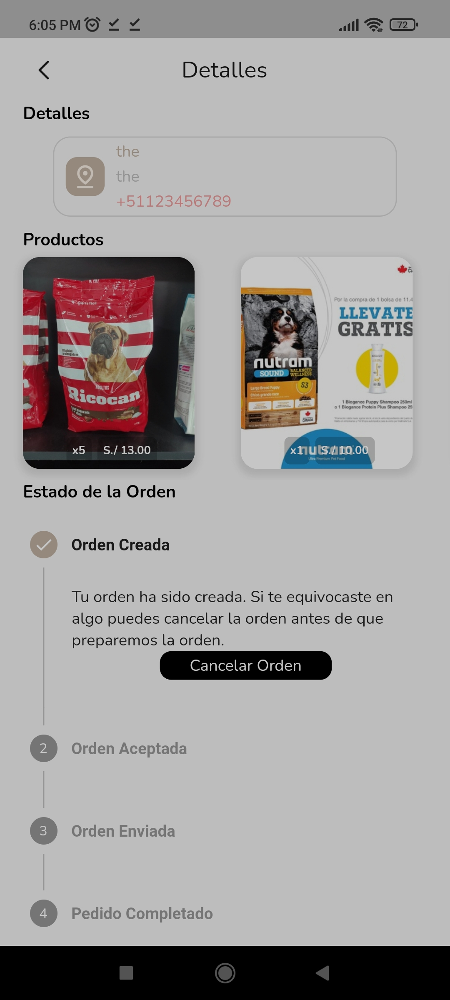 | 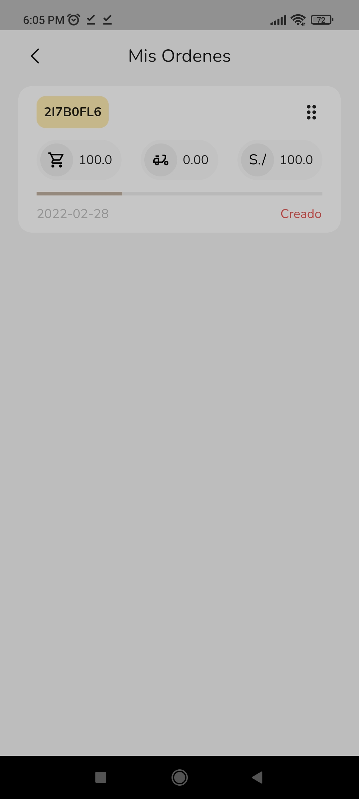 | 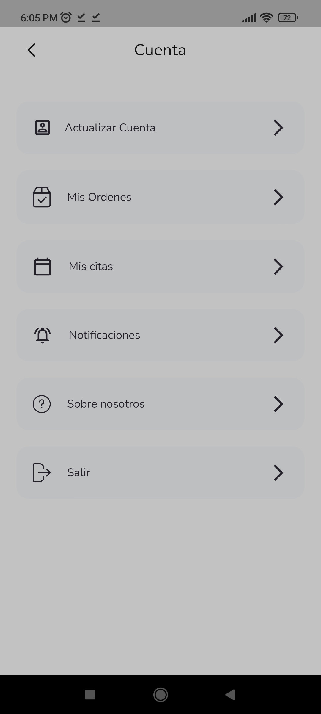 |

## TECHNOLOGIES
### BACKEND
- DRF

### FRONTEND
- TailwindCss

### MOBILE
- Flutter (Android/iOs)

### DATABASE
- PostgreSQL

### HOSTING
- Digital Ocean

## DESIGN TOOL
- draw.io (use case, class diagram,sequence)
- Whimsical

## METHODOLOGY
- Kanban
  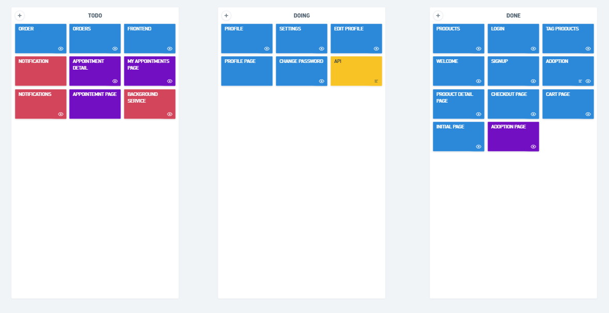

## tools
- Postman (test api endpoints)